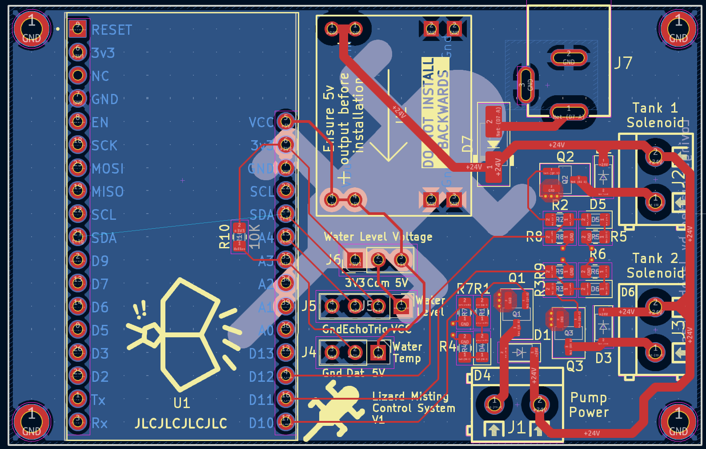
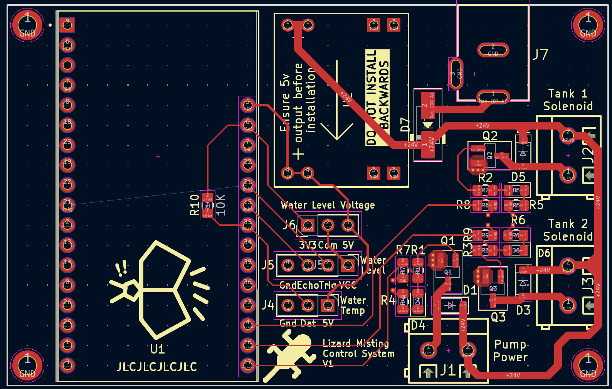

A circuit board design and ESPHome script for a control board responsible for a misting system for two tanks.  
A route from the pump to each tank can be enabled using solenoids attched to their labelled terminals. Powered terminals
will be indicated by an indicator LED, including when the pump is powered.

There are also a header for a Dallas 1-Wire DS18b20 waterproof temperature sensor for measuring the temperature of the 
water Tank, and a header for a HC-SR04 ultrasonic Distance sensor for use as a water level indicator. The HC-SR04 header
has an associate voltage selector header as they're supposed to be 5v but my cheap ones overheated above 3v3.

The board is powered using a 24V DC Barrel Jack and powers the pump and solenoids directly. This design has sized 
components and traces for 3A, which is generous for the required current for the ESP, pump, and two solenoids.

